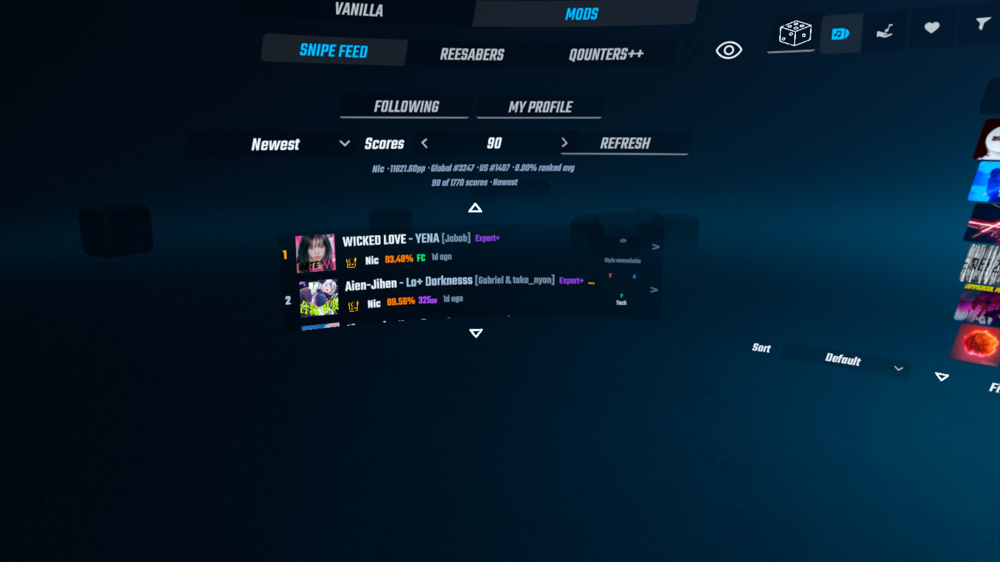
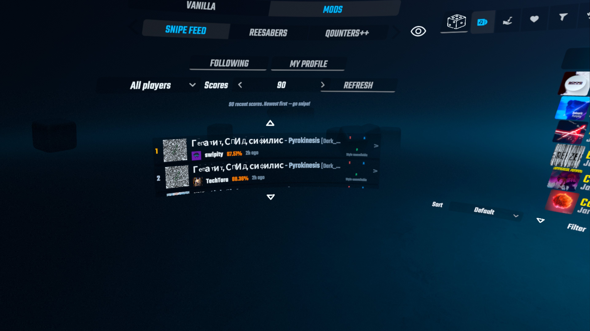
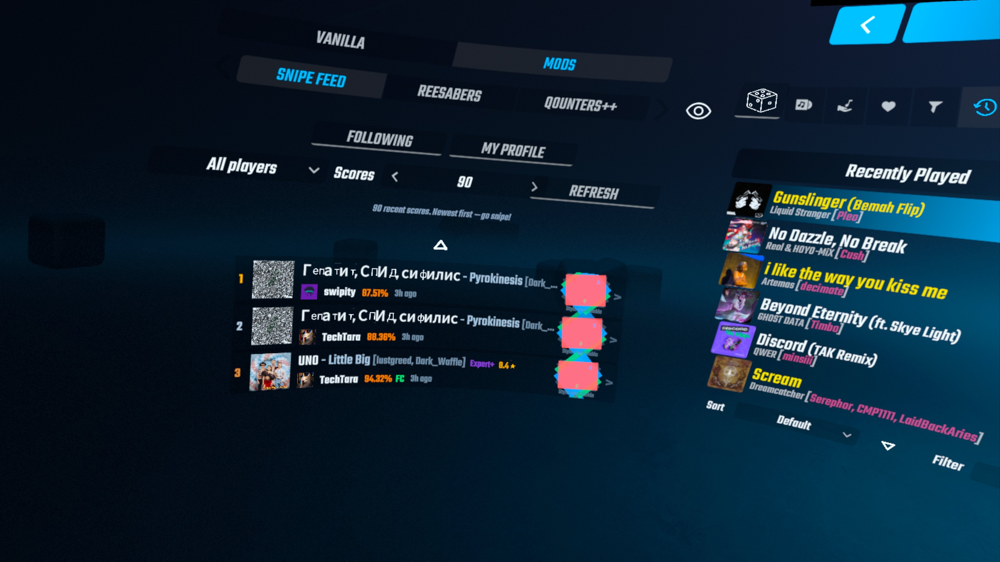
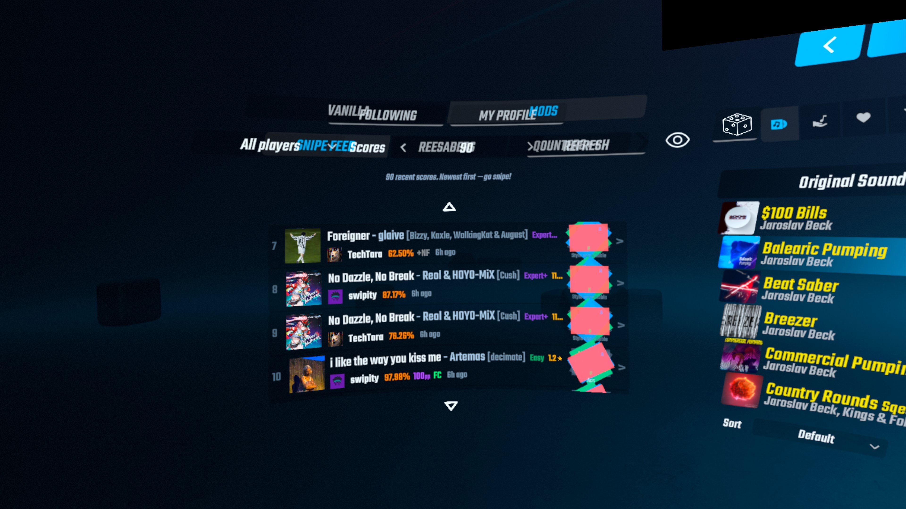
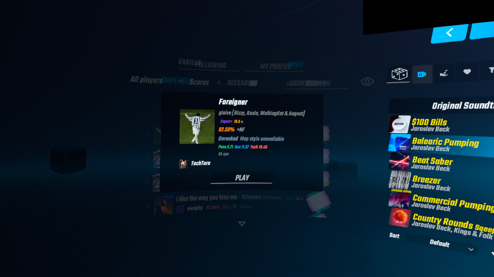
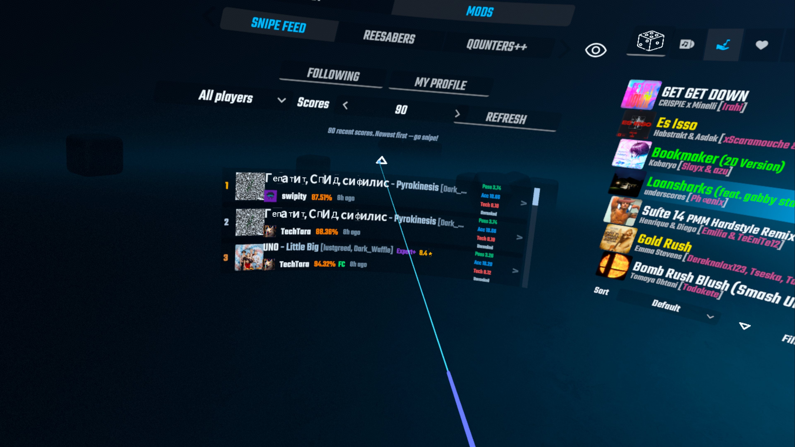

# SnipeFeed

Your BeatLeader following feed inside Beat Saber — on **Quest standalone and PCVR**. Adds a **Snipe Feed** tab to the gameplay setup panel's **Mods** section — the left screen of song selection, next to tabs like ReeSabers and Qounters++ — that lists the most recent scores of every player you follow on BeatLeader — newest first — so you know exactly which maps to snipe without taking the headset off.


## Current status

The current `main` branch contains the Quest **v3.3.2** update. The Quest package manifests report `3.3.2`, and the remote `v3.3.2` tag points to this update, which adds **My Profile**, server-side score ordering, exact Pass/Acc/Tech tiers, adaptive feed sizing, and the draggable side scrollbar documented below.

The PCVR project is a separate build target and remains at **2.0.1-pc.1** (`pcvr/manifest.json`); the v3.3.2 changes are Quest-only.

## Screenshots and photo upload areas

The screenshots below document the current Quest UI. To add or replace photos, upload the image beside this README (the existing files use the `ingame*.jpg` naming pattern) and add an image entry here with descriptive alt text. Keep one screenshot per workflow so the photo's purpose is clear.













## Two versions, one repo
| Platform | Source | Download |
|---|---|---|
| **Quest standalone** | this directory (C++ / Scotland2 qmod) | [Releases](https://github.com/NotNic182/SnipeFeed/releases) — `SnipeFeed.qmod` |
| **PCVR** | [`pcvr/`](pcvr/) (C# / BSIPA plugin) | [Releases](https://github.com/NotNic182/SnipeFeed/releases) — `SnipeFeed.PC-*.zip` |

Both versions share the same v2.0.0 feature set and UI: the Snipe Feed tab in every gameplay setup panel, BeatLeader-style score rows, the detail modal with **Play / Download & Play**, and automatic reuse of your BeatLeader mod login. PC requirements, build and install instructions live in [pcvr/README.md](pcvr/README.md).

## v2.0.1 fixes

- **Quest TLS verification**: peer verification now enabled. The qmod ships Mozilla's CA bundle (`cacert.pem`, copied into the mod's ModData folder and used via libcurl `CURLOPT_CAINFO`) — newer Horizon OS builds keep system CAs in the Conscrypt APEX where native code can't read them. Android's system CA path remains as a fallback if the copy is missing.
- **Async lifetime safety**: callbacks that cross from a worker thread capture no il2cpp/Unity pointers at all, only plain data — only callbacks that are guaranteed to run and die on the main thread capture Unity objects, via `SafePtrUnity`, to prevent use-after-free.
- **Atomic map installs**: extraction now happens to a temp directory and renames into place, ensuring failed installs leave no corrupt level folders.
- **Truthful error messages**: feed empty vs. network error now clearly distinguished; cookie reuse and fallback paths clearly documented in code.
- **Bounded image caches**: both Quest and PC limit cached sprites/textures to prevent session-long memory growth.
- **No PC freeze on install**: all file I/O now runs off the main thread; map installs no longer cause VR frame drops.

**The rest of this README covers the Quest version.**

- Target: **Beat Saber 1.40.8 (build 7379), Quest standalone (aarch64), Scotland2**
- Dependencies (auto-installed from `mod.json`): beatsaber-hook, custom-types, paper2, BSML, SongCore
- Reuses the BeatLeader mod's login read-only when present (never modified or stored by SnipeFeed); otherwise only public API endpoints

## Where to find it

The tab appears in the gameplay setup panel (left screen) in **every** mode — Solo/Party song selection, online multiplayer, campaign, and modded flows like **Multiplayer+** (QBeatSaberPlus) lobbies. Open the **Mods** tab on that panel and pick **Snipe Feed**.

Inside Snipe Feed, use **Following** for the friends feed or **My Profile** for your BeatLeader summary and score history. My Profile shows PP, global/country rank, ranked average accuracy, and a bounded score list. Its dropdown asks BeatLeader to order the list by newest, stars high/low, or accuracy best/worst; the existing **Scores** stepper controls the page size (10–100).

## What the Play button does (per mode)

Tap any score row to open its details. The button at the bottom adapts to where you are:

| Where you are | Button | What happens |
|---|---|---|
| Solo song selection | **Play** / **Download & Play** | Downloads the map if needed, then the menu briefly hops out and back in with the sniped song selected, ready to play. |
| Party song selection, Multiplayer song-select screen | **Play** / **Download & Play** | Downloads the map if needed, then selects the song directly in the open picker — no hop (the re-enter hop is Solo-only). |
| A lobby (vanilla multiplayer or Multiplayer+) | **Download** / **In Custom Levels** | Downloads and installs the map only — the mod never yanks you out of a lobby. Then pick the song through the lobby's own song picker so the whole room gets it. |
| Score on an official OST/DLC song | *(disabled)* | Official songs have no downloadable map. |

In Party mode the song is selected in place in the open picker on both platforms (the re-enter hop is Solo-only).

## Setup (one time)

1. Install `SnipeFeed.qmod` (see Install below).
2. Enter **Solo**, then on the left panel open the **Mods** tab and select **Snipe Feed**.
3. If you are logged in inside the official BeatLeader mod, the feed and **My Profile** load automatically — nothing to enter. Then press **Refresh**.

No BeatLeader mod login? Put your BeatLeader player ID into the mod's config file (`ModData/.../Configs/snipefeed.json`, `PlayerId`) and the feed uses the public API instead.

## Install

**ModsBeforeFriday (recommended):** open [mbf.bsquest.xyz](https://mbf.bsquest.xyz) in Chrome/Edge with the headset connected, and drag `SnipeFeed.qmod` into the "upload mods" area.

**QuestPatcher:** drag `SnipeFeed.qmod` into the mods list.

**ADB (dev loop):** with the game closed, push the qmod via MBF, or copy just the rebuilt `build/libsnipefeed.so` to the Scotland2 late mods folder and restart the game.

## Build from source

Requires: qpm CLI, CMake, Ninja, PowerShell 7. Android NDK is managed by qpm.

```
qpm restore
qpm ndk resolve -d
qpm s build      # compiles build/libsnipefeed.so
qpm qmod manifest # regenerates mod.json
qpm s qmod       # packages SnipeFeed.qmod
```

## How it works

1. If the official BeatLeader mod's login cookie exists on the headset (`ModData/.../Mods/bl/cookies/cookies.txt`), one call to `GET api.beatleader.com/user/friendScores?sortBy=date&order=desc` returns the same feed the BeatLeader website home page shows. The cookie is read-only reused, never modified or logged.
2. **My Profile** resolves the headset login through the same `GET /user/modinterface` endpoint used by the official Quest mod, falling back to the configured `PlayerId`. It then reads `GET /player/{id}/scores` with BeatLeader's documented `sortBy`, `order`, `page`, and `count` parameters.
3. Entries are rendered with player, accuracy, PP, FC flag, song, difficulty, stars, modifiers, and time ago. Missing/unranked star data is simply omitted.

All requests run on a background thread with 15s timeouts; UI updates go through BSML's main-thread scheduler. If the network is down or the ID is wrong, the view shows an error message and the game is unaffected.

## Map style and rating tiers

Each score row reserves a compact BeatLeader map indicator at the right edge. It uses only fields already included in that score's `leaderboard.difficulty` object, so it adds no requests and no image-cache entries.

| BeatLeader data on the score | What SnipeFeed shows |
|---|---|
| `passRating`, `accRating`, and `techRating` are all numeric | Three plain colored tiers show the exact **Pass**, **Acc**, and **Tech** values. The detail modal shows the same values. |
| No complete rating triple, but `type`, `styleTags`, or `speedTags` has a known bit | The authoritative style label is shown (for example **Speed**, **Midspeed**, **Acc**, **Tech**, **Linear**, or **Stream**). |
| No complete rating triple and no recognized style metadata | The row shows the real difficulty status when available, otherwise **ratings unavailable**. The detail modal says the BeatLeader rating graph is unavailable. SnipeFeed does not infer a style or rating. |
| Ranked map | Normally receives the three rating fields and therefore gets the exact tiers; its detail line says **Ranked**. If BeatLeader omits any field, SnipeFeed degrades to the label/unavailable rules above. |
| Unranked or non-graphed map | Its detail line says **Unranked** when the status is present. It can still show an explicit BeatLeader type/tag, but never a fabricated rating or accuracy estimate. |

Pass is BeatLeader's pass rating, not a guessed speed rating. Speed and midspeed appear only when BeatLeader explicitly supplies those map-type bits.

## Quest v3.3.2 features

- **My Profile view**: switch between Following and your own BeatLeader profile, including PP, global/country rank, ranked average accuracy, score history, and server-side sorting by newest, stars, or accuracy.
- **Exact rating tiers**: graphed maps show BeatLeader's Pass, Acc, and Tech values as compact colored text; unranked/non-graphed maps fall back to authoritative style/status text without estimates.
- **Taller feed layout**: the list uses the measured gameplay-panel height without overlapping the game's tab strip.
- **Side scrollbar**: grab and drag the always-visible bar or keep using the thumbstick. The old top/bottom caret controls are not created, leaving the full list height available for rows.

## v2.0.0 features

- **Lives in the gameplay setup panel, everywhere**: the feed is a **Snipe Feed** tab in the left panel's **Mods** section — in Solo/Party, online multiplayer, campaign, and Multiplayer+ lobbies (`MenuType::All`). No more main-menu button.
- **Full-height list**: the list is sized from the tab's actual measured height instead of a hardcoded guess. Quest v3.3.2 replaces the old page arrows with a draggable side scrollbar.
- **Mode-aware Play button**: in-place selection where a song picker is open, the quick re-enter hop in Solo, and download-only in lobbies — the mod never dismisses an active lobby flow (doing so corrupts the menu state; learned the hard way).
- **Modal fixes**: the detail popup closes instantly when launching and can never linger across menu transitions.

## v1.0.0 features

- **Song-first rows**: the title line moved to the top of each row and grew — "Song Name - Artist [mapper]" with difficulty and stars — while the player identity (avatar + name) moved underneath at a smaller size, next to the score stats and time-ago. The mapper name now comes straight from BeatLeader's song metadata and also appears in the detail modal's byline.

## v0.5.0 features

- **Row-based feed layout**: every score is one clean horizontal row — rank, uniform cover art, avatar + prominent player name with the time-ago right beside it, and a single info line (song name · difficulty · stars · accuracy · FC) with clear spacing between stats. A right-edge chevron marks each row as selectable. Fixes the v0.4.0 bug where the player name never rendered (the name line was vertically ellipsized away by its own row height).
- **Consistent stat colors**: difficulty keeps BeatLeader's per-difficulty colors (spelled out as "Expert+"), stars yellow, accuracy orange, FC green, secondary text muted gray.
- **Adjustable feed size**: a "Scores" stepper (10–100, default 50) controls how many scores a refresh pulls on both the friends-feed and public-API paths (on the public-API path the per-player pull scales up to meet the stepper, capped at 20 per player).
- **Simplified header**: the ID search bar is gone — the feed uses the BeatLeader mod login on the headset (`PlayerId` in the config file remains as a fallback for the public API). One control row holds the player filter dropdown, the Scores stepper, and Refresh; the redundant heading label is gone too.
- **Wider, denser list**: the list and header rows share one 105-unit content width, filling the previously empty horizontal space; row backgrounds are darker so entries separate visually; status line is small muted secondary text; scroll arrows centered over the rows.

## v0.4.0 features

- **BeatLeader-style score cards**: each row displays song cover art (left), player avatar with name and time-ago (center), song title with colored difficulty and star rating, and color-graded accuracy / purple PP / FC badge / modifiers.
- **Detail modal redesigned**: large cover art at top, avatar + player row, colored stats display. **Play / Download & Play** button: checks installed custom levels via SongCore by hash; if missing, downloads the map zip from BeatSaver, installs it into the custom levels folder, refreshes SongCore, then jumps straight to the song.
- **Parallel score loading**: followed players' scores now load in parallel (up to 4 at once) when using the public-API path — much faster refresh on feeds with 20+ followed players.
- **2-minute feed cache**: the feed is kept in memory between menu visits — reopening is instant. Press **Refresh** to force a reload from the API.
- **Image caching**: song covers and player avatars are cached per session and downloaded once per URL.

## Known limitations

- Official OST/DLC map scores have no custom-song hash — their Play button is disabled ("Not a custom song").
- Follows capped (default 20 players × 3 scores) in the public-API fallback path; the friends-feed path (BeatLeader login cookie) gets everything in one request.
- My Profile displays one bounded page (10–100 scores), not an infinitely scrolling copy of the website.

## Headset smoke test and rollback

1. Install the qmod on Beat Saber `1.40.8_7379`, restart the game, and open **Mods → Snipe Feed** in Solo.
2. Confirm **Following** still loads, filters by player, opens score details, and leaves installed/download actions unchanged.
3. Find one ranked/graphed score and verify its colored Pass/Acc/Tech tiers match the exact values in the detail modal.
4. Check an unranked or non-graphed score: verify an explicit BeatLeader style/status is shown when present, otherwise `ratings unavailable` / graph unavailable appears; no rating or accuracy estimate should be fabricated.
5. Drag the side scrollbar and use the thumbstick; verify both scroll the list, the handle tracks the position, and no stock top/bottom caret remains. Scroll enough to recycle rows, then scroll back and confirm neither rating/style text, cover, nor avatar leaks from a previously bound score.
6. Open **My Profile**. Confirm the logged-in BeatLeader account is shown (or the configured `PlayerId` fallback), then test all five order choices and verify unranked scores do not show a fake star value.
7. Toggle between both views during a refresh, reopen the tab within two minutes to exercise the cache, and test an offline refresh plus an empty/invalid `PlayerId` without a BeatLeader login.
8. In Solo, a Party picker, and a multiplayer lobby, open a profile score and verify the button respectively re-enters/selects, selects in place, or remains download-only.

To roll back, uninstall this qmod and reinstall the previously known-good `SnipeFeed.qmod`; the only persistent SnipeFeed data is its config and CA bundle, so no score or BeatLeader account data needs migration. Restart Beat Saber after either operation.
